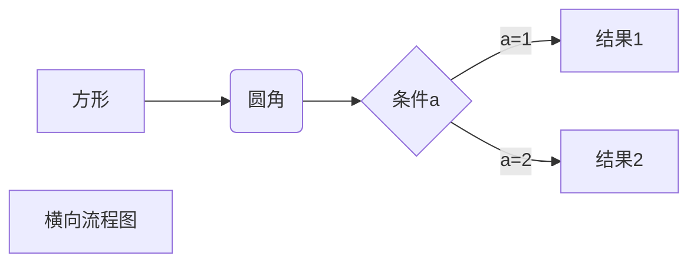

欢迎来到我的博客做客！！
<!--more-->

# 第一个一级标题

> 这是引用的内容
>> 这是引用的内容
>>>>>>>>>> 这是引用的内容
*****
[简书](http://jianshu.com)
我展示的是一级标题
====================
我展示的是二级标题
----------------

runoob.com  
google.com

*斜体*
_斜体文本_
**粗体**
***粗斜体***

分割线
********  

# 第二个一级标题
<u>待下划线文本</u>  
创建脚注格式类似这样 [^RUNOOB]  

[^RUNOOB]:菜鸟教程 -- 学的不仅是技术，更是梦想！！  
* 第一项  
* 第二项  
* 第三项

+ 第一项
- 第一项


1. 第一项
2. 第二项
3. 第三项

1. 第一项：
    - 第一项嵌套的第一个元素
    - 第一项嵌套的第二个元素
2. 第二项：
    - 第二项嵌套的第一个元素
    - 第二项嵌套的第二个元素


> 区块引用  
> 菜鸟教程  
> 学的不仅是技术，更是梦想

> 最外层
>> 第一层嵌套
>>> 第二层嵌套

区块中使用列表
> 1. 第一项
> 2. 第二项
> + 第一项
> + 第二项
> + 第三项

列表中使用区块  
* 第一项  
> 菜鸟教程  
> 学的不仅是技术更是梦想  

* 第二项   
# 第三个一级标题
代码  
`printf()` 	

	<?php
	echo 'RUNOOB';
	function text(){
		echo 'test'
	}   

```javascript
$(document).ready(function(){  
	alert('RUNOOB');  
});
```


链接地址  
这是一个链接地址 [菜鸟教程](https://www.runoob.com)  

直接使用链接地址 <https://www.baidu.com>


高级链接  
这个链接用 1 作为网址变量 [google][1]  
这个链接用 runoob 作为网址变量 [Runoob][runoob]  
然后在文档的结尾为变量赋值 (网址)  
[1]: http//www.google.com/  
[runoob]: http://www.runoob.com/  


  


| 左对齐 | 右对齐 | 居中对齐 |
| :-----| ----: | :----: |
| 单元格 | 单元格 | 单元格 |
| 单元格 | 单元格 | 单元格 |

不在Markdown覆盖范围之内的标签，都可以在文档里面用html编写  
使用 <kbd>Ctrl</kbd>+<kbd>Alt</kbd>+<kbd>Del</kbd> 重启电脑




[查看更多Markdown技巧](https://www.runoob.com/markdown/md-advance.html)